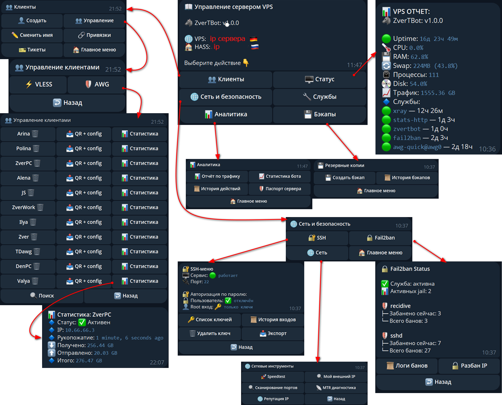
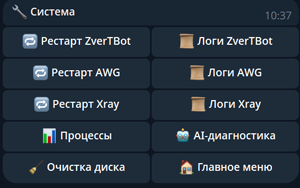

# ZverTBot

> Telegram-бот для управления VPN-инфраструктурой и мониторинга VPS.


**ZverTBot** предоставляет единый Telegram-интерфейс для управления VPN-клиентами и серверными сервисами на базе **Xray / VLESS** и **AmneziaWG**.

Проект объединяет управление VPN-клиентами, привязку Telegram-пользователей, мониторинг сервисов, сетевую диагностику, статистику, резервное копирование и анализ логов.

Отдельный интеграционный контур обеспечивает передачу данных в **Home Assistant** для мониторинга инфраструктуры и отображения состояния VPS на dashboard.

## Возможности

### VPN и управление клиентами


- **Xray / VLESS**
- **AmneziaWG**
- создание и удаление VPN-клиентов
- управление клиентскими конфигурациями
- генерация QR-кодов
- привязка VPN-клиентов к Telegram-пользователям
- просмотр информации и статистики по клиентам

### Мониторинг и диагностика

- контроль состояния системных сервисов
- мониторинг Xray и AmneziaWG
- просмотр логов сервисов
- диагностика сетевых соединений
- сетевые инструменты
- проверка IP reputation
- управление и мониторинг Fail2ban
- LLM-анализ логов и диагностика проблем
- просмотр процессов и системного состояния VPS

### Системное управление


- управление поддерживаемыми системными сервисами
- перезапуск сервисов
- очистка дискового пространства
- резервное копирование
- просмотр системной статистики

### Home Assistant


- передача статистики VPS в Home Assistant
- мониторинг состояния VPN-сервисов
- передача накопительного трафика Xray
- GeoIP-информация по подключениям
- мониторинг сетевых соединений
- контроль SSH-туннеля до Home Assistant
- интеграция с системой мониторинга Kuma
- health-check инфраструктуры
- подробная инструкция по интеграции находится в `docs/HASS.md`.

### Качество проекта

- централизованный callback router
- централизованная архитектура навигации
- разделение handlers / services / runtime state
- автоматические тесты на базе `pytest`
- статический анализ кода с помощью Ruff

## Архитектура

ZverTBot разделён на несколько уровней ответственности.

Telegram-интерфейс и контур мониторинга Home Assistant являются независимыми потребителями состояния серверной инфраструктуры.

```text
                              ZverTBot
                                 │
                 ┌───────────────┴───────────────┐
                 │                               │
                 ▼                               ▼
        Telegram Interface               Home Assistant
                 │                       Monitoring Layer
                 ▼                               │
        Callback Router                 ┌────────┼────────┐
                 │                      │        │        │
        ┌────────┼────────┐             ▼        ▼        ▼
        ▼        ▼        ▼           VPS      VPN     Network
      Admin   Client   Features         │        │        │
        │        │        │             └────────┼────────┘
        └────────┼────────┘                      │
                 ▼                               ▼
              Services                      Collectors
                 │                               │
        ┌────────┼────────┐                      ▼
        ▼        ▼        ▼                 JSON State
      Xray      AWG     System                  │
        │        │        │                     ▼
        └────────┼────────┘                 stats-http
                 │                               │
                 ▼                               ▼
           Runtime State                Home Assistant Dashboard
```
## Основные принципы

- единый callback router
- централизованная навигация
- screen ID отделены от Telegram callback
- navigation history управляется централизованно
- handlers отвечают за Telegram-сценарии
- services содержат основную бизнес-логику
- runtime state отделён от исходного кода
- конфигурация вынесена в отдельный слой
- безопасные Telegram helper-функции используются для критичных Telegram-операций

## Требования

Проект рассчитан на Linux VPS.

- Python 3.12+
- systemd
- Telegram Bot API
- Xray / VLESS — при использовании
- AmneziaWG — при использовании

Дополнительные сервисы и интеграции включаются по необходимости.

## Быстрый старт

Создайте Telegram-бота через [@BotFather](https://t.me/BotFather).

Клонируйте репозиторий:

    git clone https://github.com/Zver5/ZverTbot.git
    cd ZverTbot

Создайте виртуальное окружение:

    python3 -m venv .venv

Установите зависимости:

    .venv/bin/pip install -r requirements.txt

### Ручная конфигурация

Для локального запуска без installer создайте `.env` из шаблона:

    cp .env.example .env

Заполните параметры окружения, необходимые для конкретного сервера.

Минимальный набор зависит от используемых возможностей ZverTBot.
Секреты и параметры конкретного VPS хранятся только в `.env`.

### Production-развёртывание

Сначала соберите deploy-архив из текущего исходного кода:

    ./deploy/build.sh

Сборка создаёт готовый архив и installer в `deploy/output/`. Каталог `deploy/output/`
содержит только генерируемые артефакты и не является частью исходного кода.

Для установки на новый VPS используйте deploy-механизм:

    deploy/botinstaller/

Установщик запускается от `root` и выполняет подготовку целевой системы.
В частности, он:

- проверяет ОС, сеть и DNS;
- устанавливает необходимые системные пакеты;
- распаковывает deploy-архив в `/opt/ZverTBot`;
- проверяет версию `BOT_VERSION`;
- создаёт Python virtual environment и устанавливает зависимости;
- создаёт необходимые runtime-каталоги;
- создаёт или обновляет `/opt/ZverTBot/.env` на основе установленного шаблона и параметров установки;
- устанавливает и валидирует GeoIP-базы;
- применяет необходимые системные настройки;
- устанавливает systemd unit-файлы;
- включает и запускает предусмотренные службы;
- выполняет базовую проверку установленной системы.

Во время установки installer запрашивает `BOT_TOKEN`, `ADMIN_CHAT`
и опциональный `HA_TUNNEL_IP`, автоматически определяет публичный
`SERVER_IP`, а также обнаруживает существующие конфигурации Xray и AmneziaWG
и их пути на целевом VPS.

Конфигурационные файлы Xray и AmneziaWG не копируются из исходного VPS
и не включаются в deploy-архив. Обнаруженные пути и серверные параметры
записываются в `/opt/ZverTBot/.env`.

Подробная инструкция по сборке deploy-архива, установке и переносу
находится в `docs/DEPLOY.md`.

### ☕ Поддержать проект

Если ZverTBot оказался полезен и вы хотите поддержать дальнейшую разработку:

[💙 Поддержать через ЮMoney](https://yoomoney.ru/quickpay/fundraise/button?billNumber=1K06JT2C922.260831)

[💳 Поддержать через PayPal](https://paypal.me/zver78)

## Конфигурация

Секреты и серверные параметры хранятся в `.env` и не должны добавляться в Git.

Шаблон конфигурации:

    .env.example

Дополнительные параметры и их назначение описаны в `.env.example`.

Основной конфигурационный слой:

    config/
    ├── config.py
    ├── paths.py
    ├── secrets.py
    └── __init__.py

## Структура проекта

    ZverTBot/
    ├── config/        # конфигурация
    ├── core/          # router, navigation, state
    ├── data/          # хранилища и статические данные
    ├── deploy/        # installer и systemd
    ├── docs/          # документация
    ├── handlers/      # Telegram handlers
    ├── hass/          # Home Assistant
    ├── services/      # бизнес-логика
    ├── ui/            # клавиатуры и screens
    ├── utils/         # helpers
    ├── scripts/       # вспомогательные scripts
    ├── tests/         # тесты
    ├── main.py
    ├── requirements.txt
    ├── .env.example
    ├── .gitignore
    └── LICENSE

## Тестирование

Полный набор автоматических тестов:

    .venv/bin/python -m pytest -q

Статический анализ:

    .venv/bin/python -m ruff check .

## Безопасность

Не добавляйте в Git:

- `.env`
- Telegram bot tokens
- API keys
- SSH private keys
- runtime state
- production JSON-файлы
- GeoIP database files

Используйте `.env.example` для настройки окружения.

## Статус

ZverTBot находится в активной разработке.

Проект предназначен прежде всего для управления собственной VPS/VPN-инфраструктурой, но открыт для изучения, модификации и самостоятельного развёртывания.

## Лицензия

ZverTBot распространяется под лицензией **MIT**.

Полный текст находится в `LICENSE`.

## Автор

**Zver5**
