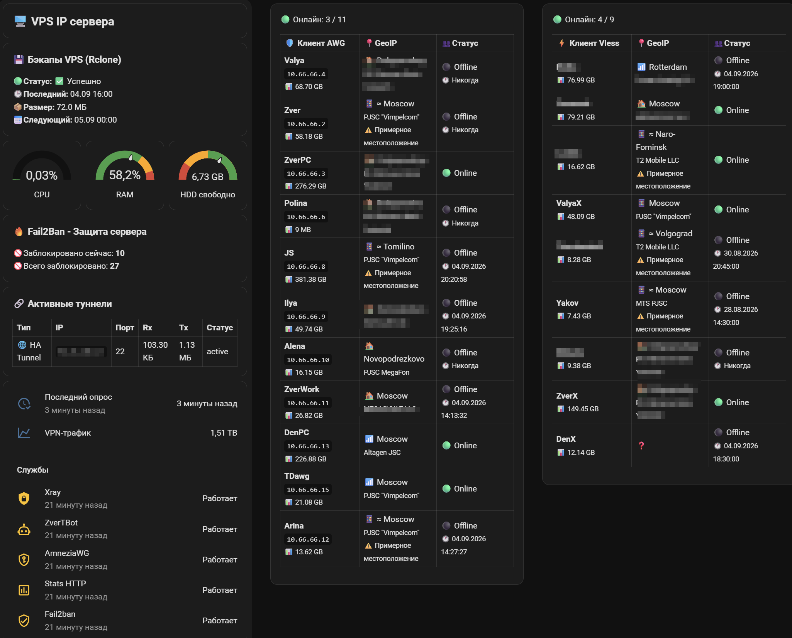

# ZverTBot — интеграция с Home Assistant

## 1. Назначение

ZverTBot предоставляет отдельную Custom Integration для Home Assistant, предназначенную для мониторинга VPS и сервисов, работающих на нём.

Интеграция получает подготовленный **VPS Status** от ZverTBot и представляет эти данные в Home Assistant в виде стандартных сущностей.



Данные могут включать:

* состояние VPS;
* CPU, RAM и дисковое пространство;
* состояние сервисов;
* резервное копирование;
* Fail2Ban;
* AmneziaWG;
* Xray;
* подключения и клиентов;
* GeoIP-данные.

Интеграция не требует ручного создания REST, template или `command_line` sensors.

### Репозиторий интеграции

[ZverTBot-ha](https://github.com/Zver5/ZverTBot-ha)

---

## 2. Архитектура

```text
ZverTBot VPS
     │
     ▼
 VPS Status
     │
     │ SSH / Existing SSH Tunnel
     ▼
ZverTBot Home Assistant Integration
     │
     ▼
 Coordinator
     │
     ├── Sensors
     ├── Binary Sensors
     └── Diagnostics
     │
     ▼
Home Assistant
```

### ZverTBot

ZverTBot отвечает за сбор, обработку и подготовку информации о VPS.

Home Assistant не обращается напрямую к внутренним файлам ZverTBot и не зависит от их формата.

### VPS Status

**VPS Status** — канонический интерфейс данных между ZverTBot и Home Assistant.

Текущий endpoint:

```text
/vps-status.json
```

Получение выполняется через SSH или существующий SSH-туннель.

Отдельный внешний HTTP-порт для интеграции не требуется.

### Home Assistant Integration

Исходный код интеграции находится в отдельном репозитории:

```text
ZverTBot-ha/
└── custom_components/
    └── zvertbot/
```

В Home Assistant компонент устанавливается в:

```text
/config/custom_components/zvertbot/
```

---

## 3. Требования

Перед установкой необходимо иметь:

* работающий Home Assistant;
* доступ Home Assistant к VPS;
* SSH-доступ к VPS;
* SSH-ключ для аутентификации.

Поддерживаются два варианта подключения:

* существующий SSH-туннель;
* прямое SSH-подключение.

При наличии стабильного SSH-туннеля рекомендуется использовать его.

---

## 4. Установка

Интеграция распространяется независимо от основного репозитория ZverTBot.

### 4.1. HACS

HACS является рекомендуемым способом установки и обновления.

Репозиторий:

https://github.com/Zver5/ZverTBot-ha

После установки компонент должен находиться в:

```text
/config/custom_components/zvertbot/
```

После установки перезапустите Home Assistant.

### 4.2. Ручная установка

Скопируйте каталог:

```text
custom_components/zvertbot/
```

из репозитория интеграции в:

```text
/config/custom_components/zvertbot/
```

После копирования перезапустите Home Assistant.

Затем добавьте интеграцию через интерфейс Home Assistant.

---

## 5. Добавление VPS

Откройте:

```text
Settings → Devices & services → Add Integration
```

Выберите:

```text
ZverTBot
```

После этого выберите способ подключения.

### 5.1. Existing SSH Tunnel

Используется, если Home Assistant уже имеет настроенный SSH-туннель до VPS.

Интеграция использует существующий канал вместо создания отдельного внешнего подключения.

### 5.2. Direct SSH

При выборе Direct SSH интеграция подключается непосредственно к VPS.

Необходимо указать:

* адрес VPS;
* SSH-порт;
* SSH-пользователя;
* SSH-ключ.

После ввода параметров интеграция проверяет подключение и получает VPS Status.

---

## 6. Обновление данных

После успешного подключения интеграция получает VPS Status через единый Coordinator.

Отдельные сущности не создают собственные SSH-подключения.

Это позволяет:

* централизовать обновление данных;
* использовать одно состояние VPS для всех сущностей;
* избежать множества независимых SSH-запросов;
* контролировать восстановление соединения в одном месте.

При временной недоступности VPS или SSH интеграция выполняет контролируемое восстановление подключения.

Быстрые повторные SSH-подключения не используются, чтобы не создавать лишнюю нагрузку и не провоцировать срабатывание Fail2Ban.

После восстановления связи получение VPS Status возобновляется автоматически.

---

## 7. Сущности

После успешного добавления VPS интеграция создаёт устройство ZverTBot и связанные с ним сущности.

### 7.1. Sensors

Sensors используются для числовых и текстовых данных, предоставляемых VPS Status.

В зависимости от текущей версии интеграции это могут быть:

* CPU;
* RAM;
* диск;
* backup;
* VPN-трафик;
* количество подключений;
* данные клиентов;
* статистика сервисов.

Фактический набор сущностей определяется текущей версией интеграции и доступными данными VPS Status.

### 7.2. Binary Sensors

Binary Sensors используются для состояний с двумя значениями.

Например:

* VPS доступен / недоступен;
* сервис работает / остановлен;
* backup в норме / проблема;
* SSH-соединение доступно / недоступно.

Набор сущностей зависит от текущей версии интеграции.

---

## 8. Данные VPS Status

VPS Status предоставляет интеграции уже подготовленные данные.

### 8.1. Система

Могут предоставляться:

* загрузка CPU;
* использование RAM;
* занятое, свободное и общее место на диске;
* общий VPN-трафик.

### 8.2. Сервисы

Для контролируемых сервисов могут передаваться:

* состояние;
* доступность;
* время работы;
* информация о неисправности.

В зависимости от конфигурации VPS сюда могут входить ZverTBot, Xray, AmneziaWG, Fail2Ban и другие сервисы.

### 8.3. Backup

Могут передаваться:

* результат последнего резервного копирования;
* время последнего backup;
* размер резервной копии;
* информация об актуальности состояния.

### 8.4. Fail2Ban

Могут передаваться:

* текущее количество блокировок;
* общее количество банов;
* состояние Fail2Ban;
* доступная информация об истории блокировок.

### 8.5. Клиенты и подключения

Для AmneziaWG и Xray могут предоставляться:

* список клиентов;
* состояние клиентов;
* данные подключений;
* статистика трафика;
* GeoIP-информация, если она присутствует в VPS Status.

---

## 9. Диагностика и ошибки

При проблеме необходимо определить, на каком уровне происходит сбой:

```text
Home Assistant
      │
      ▼
Integration
      │
      ▼
SSH / Tunnel
      │
      ▼
VPS Status
      │
      ▼
ZverTBot
```

### VPS недоступен

Если VPS недоступен, сначала проверьте SSH-доступ.

Если SSH не работает, Home Assistant не сможет получить новый VPS Status.

После восстановления доступа интеграция должна продолжить работу автоматически.

### SSH работает, данные не обновляются

Если SSH-доступ работает, но данные не обновляются, проверьте:

* доступность VPS Status;
* состояние интеграции;
* журнал Home Assistant;
* ошибки Coordinator.

### Один сервис работает с ошибкой

Ошибка отдельного сервиса не означает автоматически, что весь VPS недоступен.

Например, проблема Xray не должна скрывать доступные данные CPU, RAM, диска или других сервисов.

---

## 10. Безопасность

Интеграция использует SSH для доступа к VPS.

Приватный SSH-ключ используется для аутентификации и не должен попадать в:

* журналы;
* диагностические данные;
* сообщения об ошибках;
* состояние сущностей.

При Direct SSH используется контролируемое восстановление соединения.

Временная сетевая ошибка не должна приводить к серии быстрых повторных подключений.

Это особенно важно при использовании Fail2Ban.

---

## 11. Обновление

Home Assistant Integration развивается независимо от основного ZverTBot.

При обновлении через HACS или вручную обновляется только:

```text
custom_components/zvertbot/
```

Настройки подключения хранятся в Home Assistant.

После обновления рекомендуется проверить:

* состояние интеграции;
* подключение к VPS;
* время последнего обновления;
* состояние основных сущностей;
* ошибки в журнале Home Assistant.

Изменения VPS Status должны выполняться совместимо с интеграцией либо сопровождаться соответствующим обновлением компонента.

---

## 12. Legacy

Новая архитектура заменяет старую схему, при которой Home Assistant напрямую зависел от внутренних файлов и отдельных механизмов получения статистики.

К legacy относятся:

* REST sensors;
* template sensors;
* `command_line` sensors;
* ручная YAML-конфигурация для получения статистики;
* прямое использование JSON-файлов ZverTBot;
* legacy endpoint `/stats.json`.

Эти элементы не требуются новой интеграции.

После перехода на новую архитектуру старые сенсоры и связанные с ними SSH/REST-механизмы рекомендуется удалить, чтобы избежать дублирования данных и лишних подключений.

Внутренние JSON-файлы ZverTBot не являются интерфейсом интеграции и не должны использоваться Home Assistant напрямую.

---

## 13. Разделение ответственности

**ZverTBot** отвечает за сбор и подготовку данных.

**VPS Status** является каноническим интерфейсом данных между ZverTBot и интеграцией.

**Home Assistant Integration** отвечает за подключение, получение данных и преобразование их в сущности Home Assistant.

**Coordinator** централизует обновление данных внутри интеграции.

**Home Assistant** отвечает за отображение данных, dashboard, автоматизации и уведомления.
